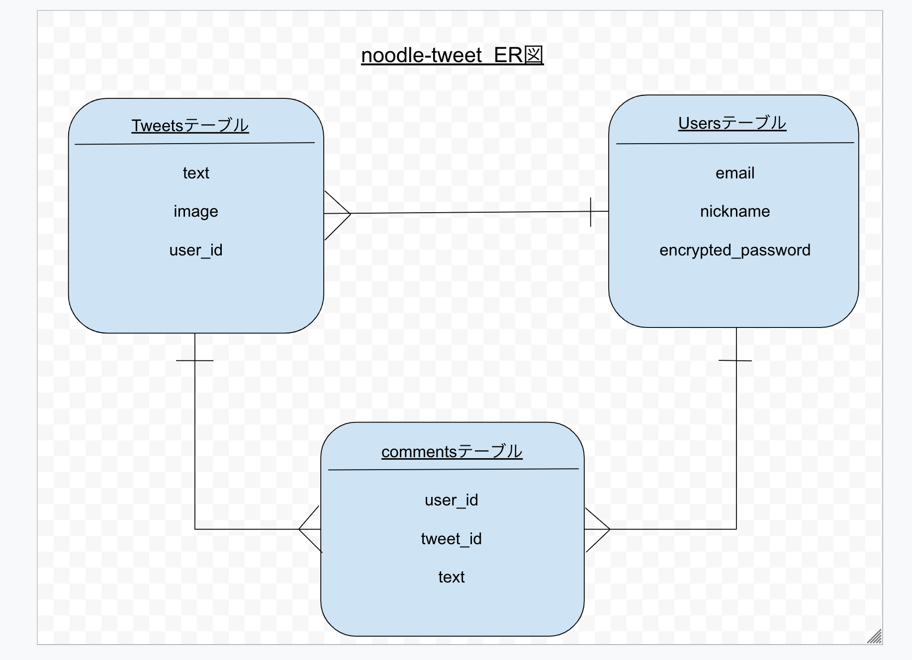
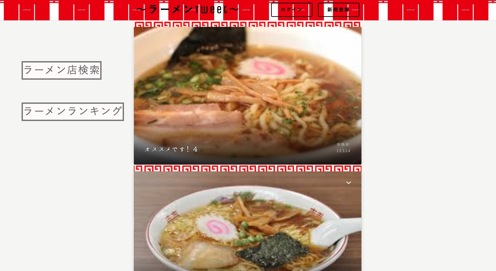
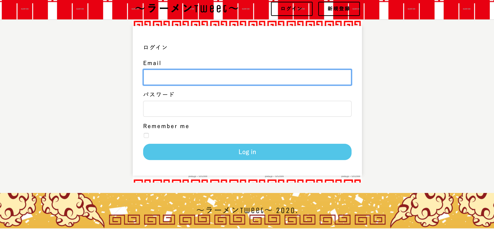
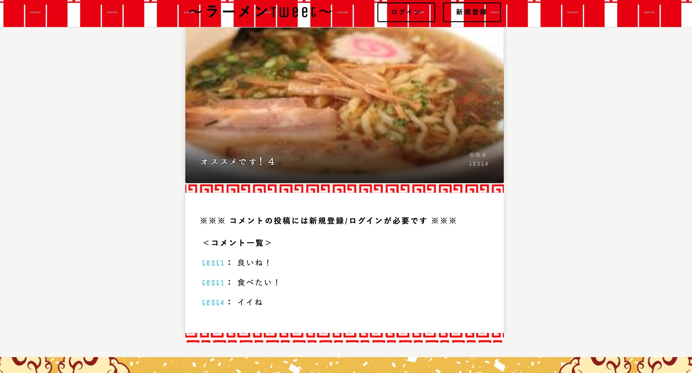

# README 
 
 

# アプリ名 

# noodle-tweet 
 

# 概要
ユーザー登録型のラーメンTweetアプリです。 
登録したユーザーがラーメン画像を載せたりTweetをする事ができます。 
登録したユーザーは他ユーザーのTweetにコメントをする事ができます。 
ラーメン店検索、ラーメンランキングをクリックすると食べログのHPに飛びます。 
 
 
# 作成の目的
アプリ開発者が無類のラーメン好きで、こんなアプリがあれば世の中のラーメン好きと繋がれるのではとの思いで作成。 
 
 
# 用途
ラーメン好きが世の中のラーメン好きと繋がれ情報共有が可能。 
 
 
# 言語
- Ruby 2.5.1 
- Ruby on Rails ~5.2.3 
- HTML,CSS 
- JavaScript 
- JQuery 
 
 

# データベース

 

 

# URL 

https://sam-ken-app.herokuapp.com/

ログイン用 
E-mail 000@000 
パスワード 000000 (0が６個) 

 

# 今後の拡張予定
Tweetに大して他ユーザーが『イイね』ができるイイね機能 
 
 

# 参考画像
## ラーメンTweet Top画面 

 

 

 

## ラーメンTweet ログイン画面 

 

 

 

## ラーメンTweet コメント画面 

 

 

 
